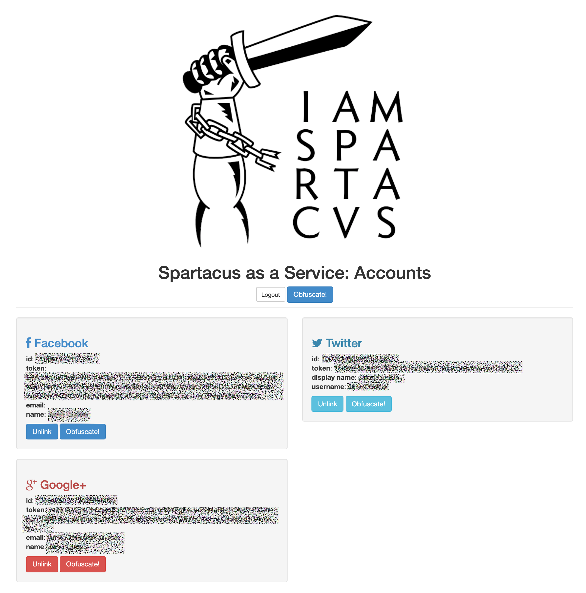

# Spartacus as a Service 

[![NPM Version][npm-image]][npm-url]
[![Build Status][travis-image]][travis-url]
[![Downloads Stats][npm-downloads]][npm-url]

Spartacus as a Service (SaaS) seeks to ensure privacy through obfuscation.

It currently seeks to do this by using OAuth to access your account and then it will flood your channel with noise (content that is not original to you, and that can dilute the power of the information that online apps retain about you.)
 
Facebook: life events (throw off your trail with bogus marriages, job changes, and the like)
Twitter: markov chain generator, drawing from a source of your choice, to fill your twitter feed with injected content

## Installation

Checkout the repo to a local directory.

## Usage example

node %spartacus directory%

Express server will startup, and then sign into online apps:

Facebook
Google
Twitter
...more coming ... 

_For more examples and usage, please refer to the [Wiki][wiki]._

## Development setup

Install node (homebrew on macos is helpful.)

Then rip through the app.js and install all the requisite modules:

"npm install <module_name> --save"

## Release History
* 0.1.0
    * The first proper release, complete with readme
    * Platforms supported with OAuth: Twitter, Facebook, Google
* 0.0.1
    * Work in progress

## Meta 

Distributed under the MIT license. See ``LICENSE`` for more information.

[https://github.com/derrumbe/Spartacus-as-a-Service](https://github.com/derrumbe/Spartacus-as-a-Service)

<!-- Markdown link & img dfn's -->
[npm-image]: https://img.shields.io/npm/v/datadog-metrics.svg?style=flat-square
[npm-url]: https://npmjs.org/package/datadog-metrics
[npm-downloads]: https://img.shields.io/npm/dm/datadog-metrics.svg?style=flat-square
[travis-image]: https://travis-ci.com/derrumbe/Spartacus-as-a-Service.svg?branch=master
[travis-url]: https://travis-ci.com/derrumbe/Spartacus-as-a-Service/
[wiki]: https://github.com/derrumbe/Spartacus-as-a-Service/wiki
